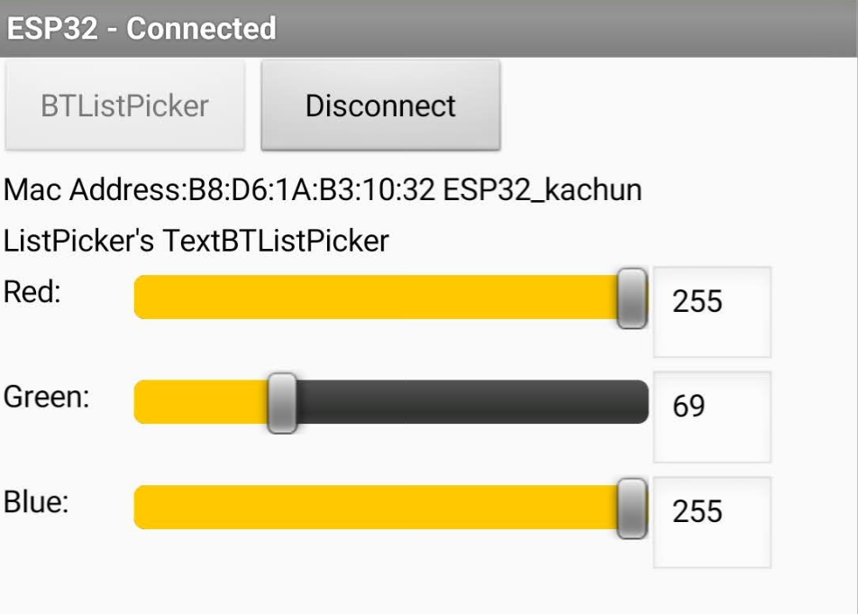
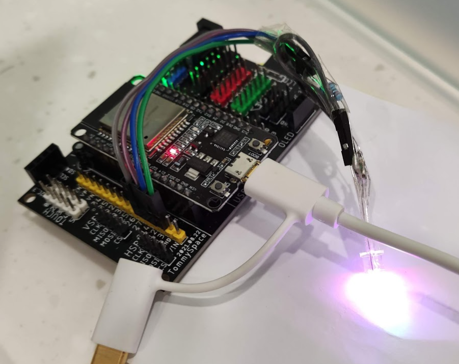
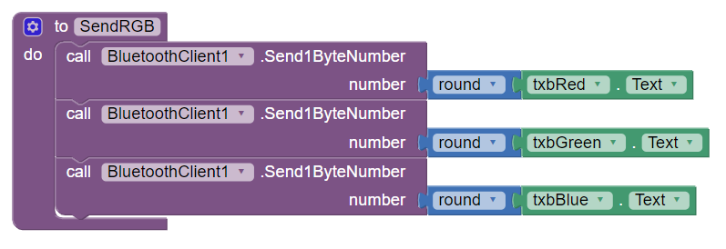

# Esp32ColorSlider
Esp32 Receive Color Channel from App Inventor 2 by 3 sliders through bluetooth

The Android App is written By App Inventor 2 named ESP32_BT_RGBColorSlider hosted in AI2 logined by zebramc36001@gmail.com

